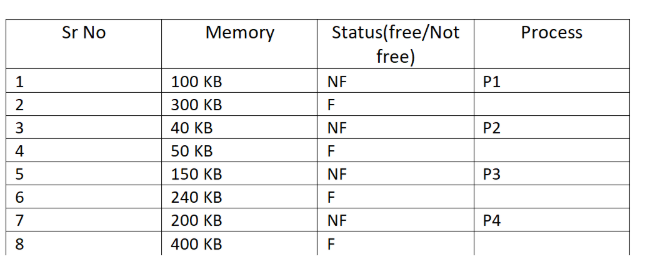
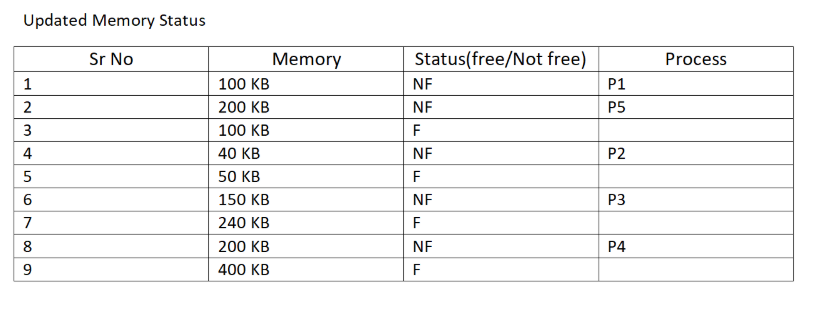

# Memory Allocation Simulator

A simple Memory Allocation Simulatory built with JAVA, for a better understanding of how memory allocation works in an **Operating System**. It simulates common **memory allocation strategies**:

- **First-Fit**
  - In the first fit approach is to allocate the first free partition or hole large enough which can accommodate the process.
  - *Advantage*: It finishes after finding the first suitable free partition. **Fastest algorithm because it searches as little as possible.**
  - *Disadvantage*: **Internal Fragmentation** - The remaining unused memory areas left after allocation become waste if it is too smaller. Thus, request for larger memory requirement cannot be accomplished.
- **Best-Fit**
  - The best fit deals with allocating the smallest free partition which meets the requirement of the requesting process. This algorithm first searches the entire list of free partitions and considers the smallest hole that is adequate.
  - *Advantage*: It then tries to find a hole which is close to actual process size needed. Memory utilization is much better than first fit as it searches the smallest free partition first available.
  - *Disadvantage*: It is slower and may even tend to fill up memory with tiny useless holes.
- **Worst-Fit**
  - In worst fit approach is to locate largest available free portion so that the portion left will be big enough to be useful. It is the reverse of best fit.
  - *Advantage*: Reduces the rate of production of small gaps.
  - *Disadvantage*: If a process requiring larger memory arrives at a later stage then it cannot be accommodated as the largest hole is already split and occupied.

---

Before processing every simulation, the user has to input the **Current Memory Division/Allocation**, i.e. Memory Division, Status, Process Name.

Currently, the memory allocation is hardcoded for saving time and easy debugging of this example.

### Current Memory Allocation

If input process is of size 200 KB, then:

#### Memory Allocation - First Fit

#### Memory Allocation - Best Fit

#### Memory Allocation - First Fit

